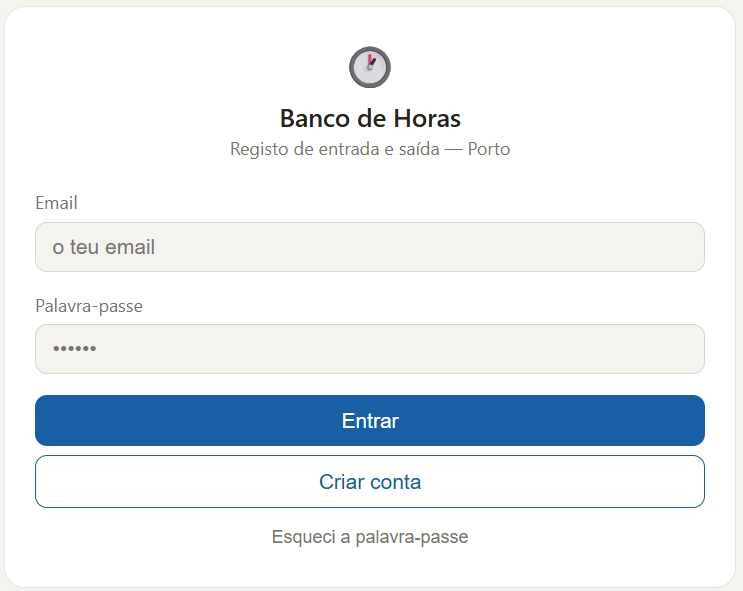
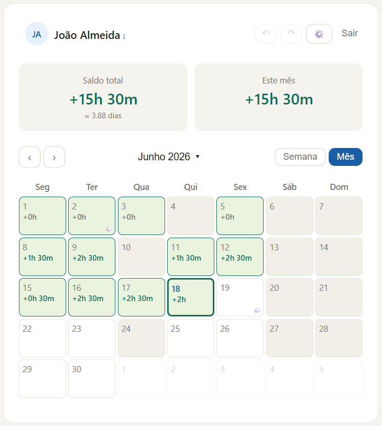
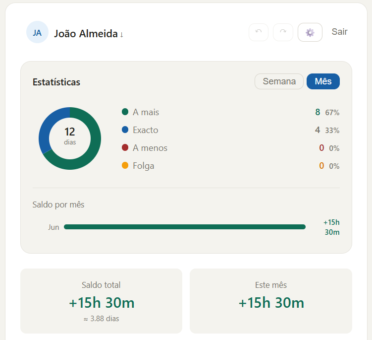
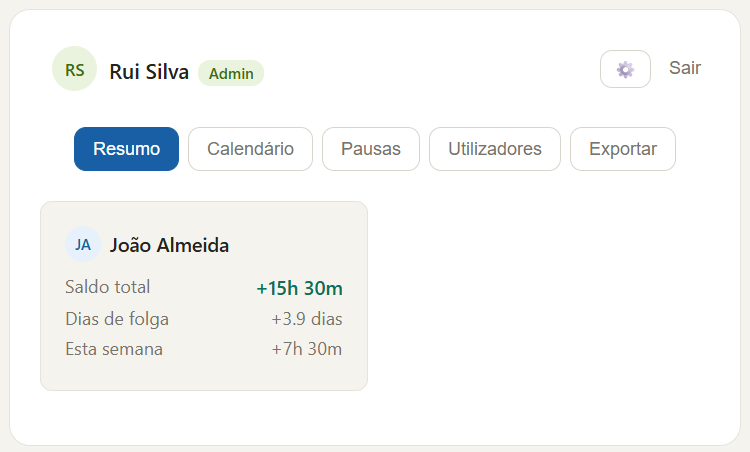
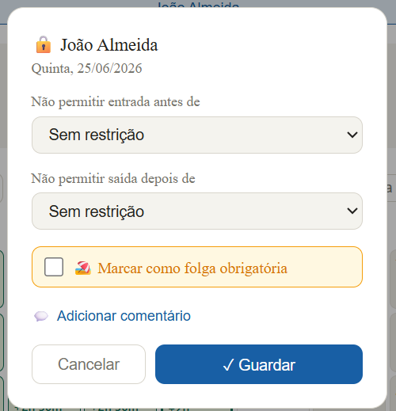
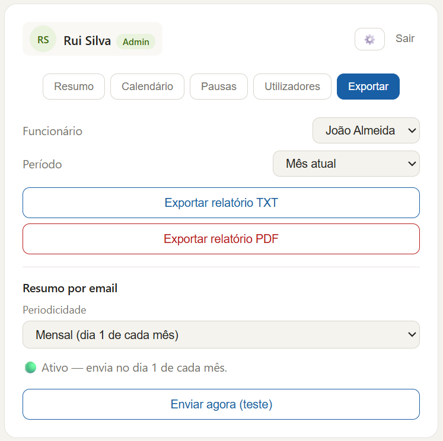
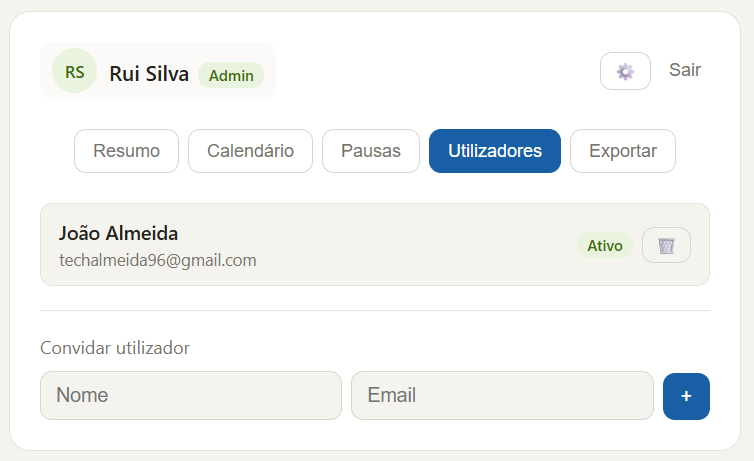
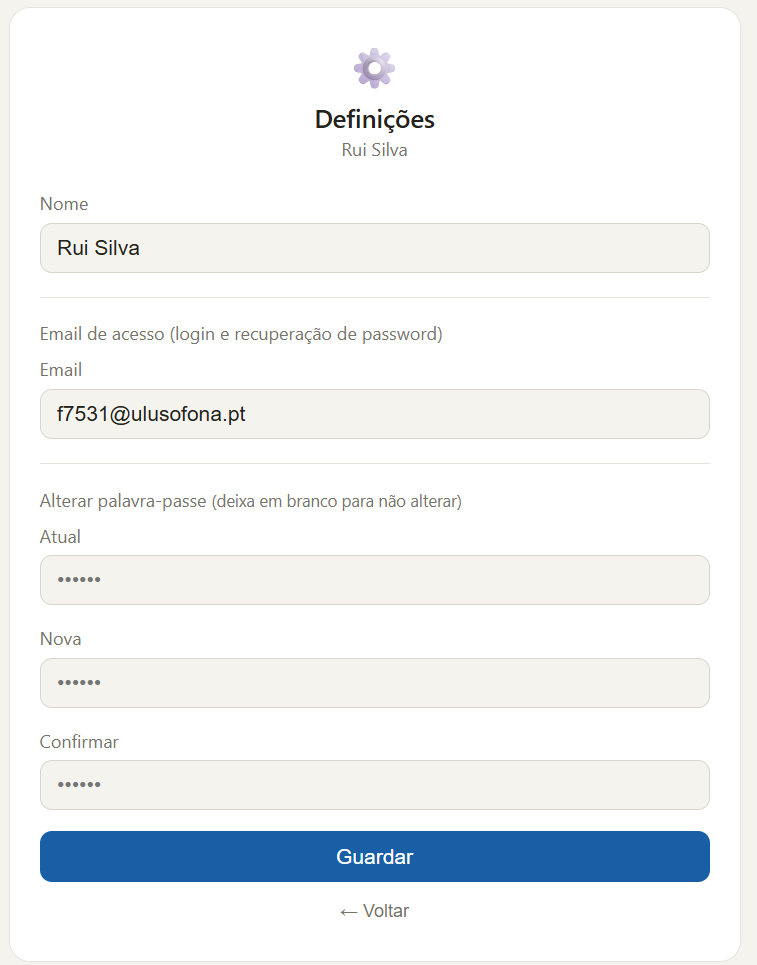
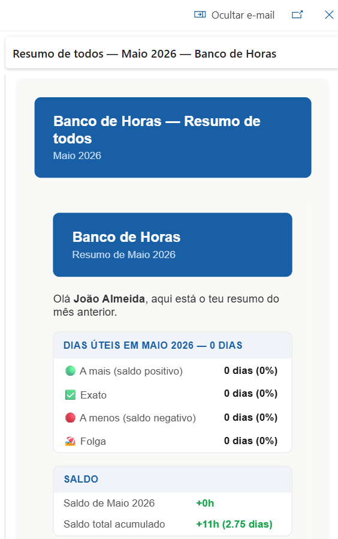

# Banco de Horas — Work Hours Tracker

> I work part-time at my university's IT department with a flexible schedule and felt the need for a simple way to track my daily working hours — to easily know how many hours I have in surplus or deficit at the end of the month.
>
> I'm a first-year Computer Engineering student and, with the help of AI (Claude by Anthropic), I built this application from scratch: a complete web app built on Google Apps Script + Google Sheets, with no external servers or infrastructure costs.
>
> The project grew from a simple hours log into a full tool with an admin panel, leave requests, PDF reports, automatic email summaries, and much more.

---

## Screenshots

### Login


### User Calendar


### Statistics


### Admin Panel — Overview


### Admin Panel — Schedule Lock


### Admin Panel — Export


### Admin Panel — Users


### Settings


### Monthly Email Summary


---

## Features

- ✅ Daily time logging (up to 3 periods per day)
- 📊 Accumulated balance, statistics and donut chart
- 🏖️ Leave requests with admin approval
- 🔒 Admin can lock schedules or mark mandatory leave
- 💬 Comments per day (shared between employee and admin)
- 📧 Email summary (weekly, monthly or yearly) with PDF attachment
- 📄 Export reports as TXT or PDF (by period and employee)
- 👤 Admin panel with calendar, statistics and user management
- 🔁 Undo/redo changes
- 📱 Responsive interface (mobile)
- 🔐 Persistent session with `localStorage`

---

## Requirements

- Google account (personal or Workspace)
- Google Sheets
- Google Apps Script

---

## Installation

### 1. Create the Google Sheet

1. Create a new Google Sheet at [sheets.google.com](https://sheets.google.com)
2. Open the menu **Extensions → Apps Script**
3. Paste the contents of `Code.gs` into the editor
4. Paste the contents of `index.html` into a new HTML file (**File → New → HTML file**)

### 2. Configure

At the top of `Code.gs`, adjust the constants:

```javascript
const START_DATE  = '2026-06-01';  // system start date (YYYY-MM-DD)
const DAILY_MINS  = 240;           // daily workload in minutes (e.g. 240 = 4h, 480 = 8h)
```

In the `initializeSheets` function, replace the initial admin email and password:

```javascript
[['admin@example.com', 'Administrator', 'changeme123', 'admin', true, '', '']]
```

> ⚠️ **Change the password after your first login** in the profile settings.

If your city has a specific public holiday, edit it in `getPortugueseHolidays`:

```javascript
map[fmtKey(year, 6, 24)] = 'Local Holiday'; // adjust date and name
```

### 3. Initialize

1. In Apps Script, run the `setupSpreadsheet` function once (**Run** menu)
2. Accept the permissions requested by Google
3. Deploy the app: **Deploy → New deployment → Web App**
   - Execute as: **Me**
   - Who has access: **Anyone** (or anyone with the link)
4. Copy the generated URL — that's your app link

---

## Structure

```
Code.gs       — server-side logic (Google Apps Script)
index.html    — web interface (HTML + CSS + JS, single file)
```

Data is stored in sheets inside the Google Sheet:

| Sheet     | Contents                          |
|-----------|-----------------------------------|
| Users     | Users and passwords               |
| Entries   | Daily time records                |
| Comments  | Per-day comments                  |
| Closed    | Closed periods (breaks/holidays)  |
| Invited   | Invited emails (pre-registration) |

---

## Security

- Passwords stored as plain text in Google Sheet (no hashing) — suitable for internal use, not recommended for sensitive data
- Sheet access controlled by Google Drive permissions
- The app runs under the script owner's account — no external credentials exposed

---

## What I Learned

This project was my first real contact with web development and server-side programming. Here are some of the main challenges I faced and what I learned from them:

### Google Apps Script and Google Sheets as a platform
I learned that Google Apps Script runs on Google's servers and communicates with the web page through `google.script.run` — meaning each server call takes 1 to 3 seconds. Understanding this was key to knowing why the app was slow and how to optimize it.

I also discovered that Google Sheets automatically converts time values (e.g. `"09:00"`) into `Date` objects, which caused a hard-to-detect bug: the server response was arriving as `null` on the client. The fix was to explicitly format all time fields before returning them.

### Performance and optimization
One of the biggest lessons was realizing that each Sheets read is a slow operation. Initially, the code read the same sheet 3 times to get different data (entries, minimum time, maximum time). I learned to consolidate those reads into a single function, which significantly reduced load time.

I also learned to use Apps Script's `CacheService` to store rarely-changing data (like the user list and closed periods) for 30 seconds, avoiding unnecessary re-reads.

### Frontend state management
I learned the difference between storing data on the server (Google Sheets) and maintaining state on the client (JavaScript variables). I implemented `localStorage` to persist the user session across page refreshes — without this, the user would have to log in every time they refreshed the page.

### UX and design decisions
Throughout the project I realized that small interface decisions have a big impact on the experience. For example:
- Auto-save (saving automatically on every time change) seemed convenient but made the app slow — I changed it to save only when the user clicks "Save"
- Decorative undo/redo buttons in the admin panel were confusing because they looked clickable but did nothing — I removed them
- Emoji buttons in the modal were misaligned — I replaced them with consistent SVG icons

### More complex features
- **Leave requests with approval**: I learned to manage intermediate states (`Pending`, `Rejected`, `Approved`) on both server and client, and keep the interface in sync with those states
- **PDF export**: I discovered that `DocumentApp` in Apps Script doesn't support all the formatting methods the documentation suggests (e.g. `body.setMargins` doesn't exist). The solution was to generate styled HTML with CSS and export it as PDF via `DriveApp`
- **HTML emails**: I learned to use `MailApp` to send formatted emails with tables and colors, and to attach PDF files

### Security and best practices for publishing
Before publishing on GitHub, I learned the importance of removing sensitive data from the code (real emails, passwords, institution name) and replacing them with generic placeholders, so anyone can use the project without exposing private information.

---

## License

MIT — free to use, no warranties.
